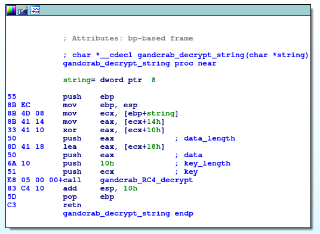
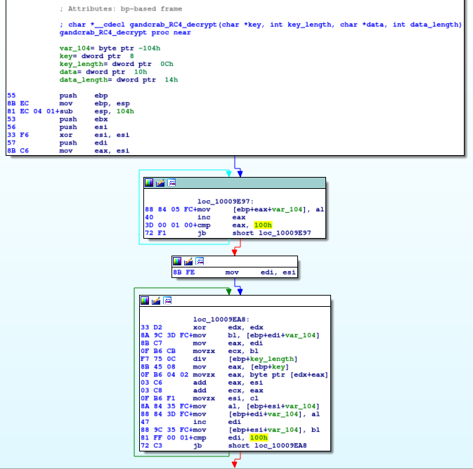
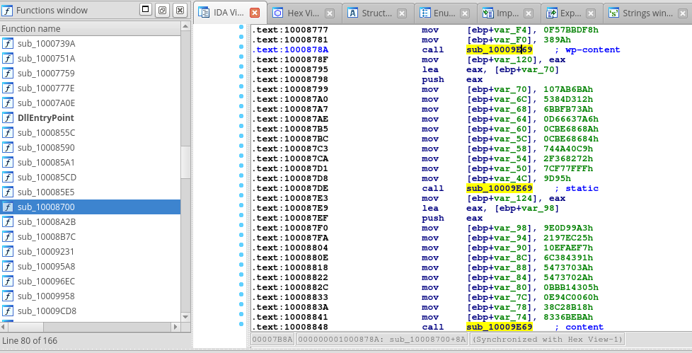
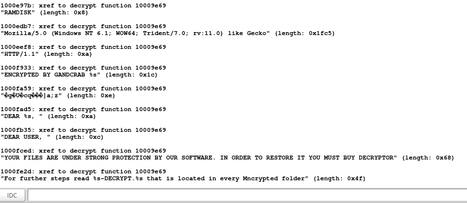

# GandCrab String Decryptor

Ida C script for string decryption.

Tested with GandCrab v 5.1
sample SHA265: 6aa3f17e5f62b715908b5cb3ea462bfa6cecfd3f4d70078eabd418291a5a7b83

## How it works

This script will try to identify the string decrypt function, which should be the most used function. Simply count xrefs for all of the functions and consider the most used function as string decryption.
String decryption function takes one argument and extracts from it the key, length of encrypted data and encrypted data itself. Encryption is RC4, as we can see below:

Then, this script finds the calls to the string decryption and reconstructs its argument from "mov" instructions which manipulate with the local variables (see picture below). After the extraction of the parameters for RC4 it is possible to decrypt string and perform check if it is ASCII or Unicode string. Finaly, this script makes the comments with decrypted values:

